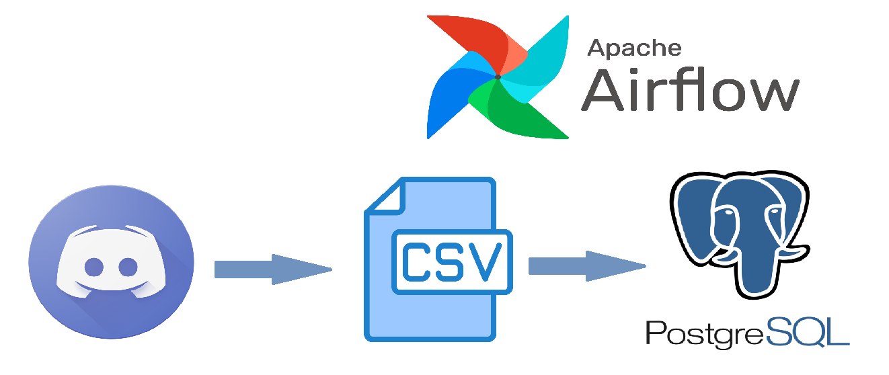
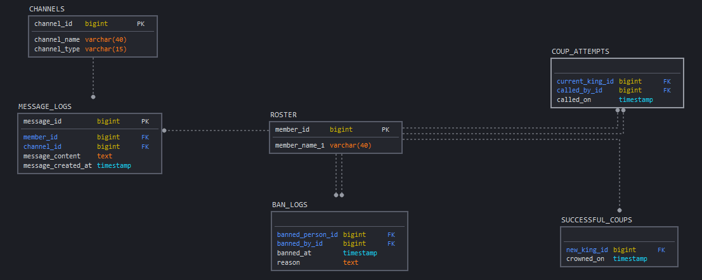

# CoupBot Data Engineering Project
## Introduction
In this repository you will find the scripts I used to create an automated pipeline for the data I generate with my [CoupBot Discord bot](https://github.com/Jlevy0/CoupBot). The purpose of this project was to introduce myself to some of the basics of Apache Airflow, as well as practice my Python and SQL skills. Data harvested from the Discord server that CoupBot administrates is written to a CSV file, which is then transferred on a nightly basis to the PSQL server using the scripts found in this repository. 

You may find it useful to look at the [data cog for CoupBot](https://github.com/Jlevy0/CoupBot/blob/main/CoupBot-main/cogs/data.py). This shows how exactly I extract the data from the Discord server, as well as some of the small transformations I do to the data to get it into a more appropriate format for PSQL. 

## Data Architecture

Data is first gathered from the Discord server using the aforementioned data cog. While the cog also tracks some fairly standard chatroom things like messages, channels and membership, the cog also tracks the unique Coup feature of CoupBot, allowing me to track how long each person reigns as the leader and who called the vote to oust them. 

Once the data is written to the CSV file, it is then transferred to the PSQL server at midnight every day. The script [Incremental_Load_dag.py](https://github.com/Jlevy0/CoupBot-Data-Engineering-Project/blob/main/dags/Incremental_Load_Dag.py) orchestrates this by ordering the [CoupBotDE_Incremental_Load.py](https://github.com/Jlevy0/CoupBot-Data-Engineering-Project/blob/main/dags/tasks/CoupBotDE_Incremental_Load.py) script to run. As such, the actual bulk of the work - truncating and updating the PSQL tables - is done by the latter file, while the former is used to schedule it and make sure it runs without a hitch. 

## Data Model

This is what the PSQL schema for this project looks like. This schema was set up using the [CoupBotDE_Full_Load.py](https://github.com/Jlevy0/CoupBot-Data-Engineering-Project/blob/main/dags/tasks/CoupBotDE_Full_Load.py) script. Unlike the incremental load script, this is only supposed to be run once, just to set up the tables and load in the data for the first time. The incremental load script then handles the daily updates.  

## Incremental Loading
The incremental load process is straightforward. At midnight, the existing data in the PSQL tables is removed using the TRUNCATE TABLE statement. We then run the COPY statement to copy the data from each CSV to their respective table. The airflow dag file makes sure that these two things happen every night and in the correct order. Lastly, the process is logged so that in case anything breaks, we can see what happened. 

## Some Final Thoughts
I took a linear approach to this project. Figure out how to set up a PSQL server, figure out how to get the CSV data into the server, figure out how to set up Airflow, etc. However, I think I underestimated just how much Airflow does for you. In the future, I'd like to take advantage of some of those features, partiuclarly if I'm going to do a project with, say, multiple dependencies.
